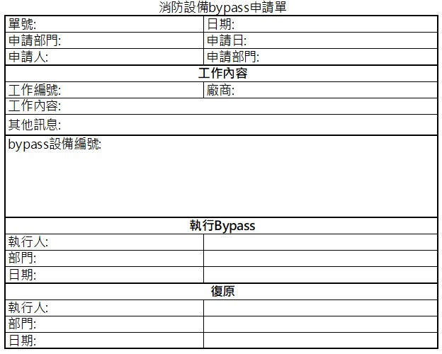

# fire_detector_management
## 簡介
* 一大樓或工廠內有許多的火警偵測器，在平常它們是用來偵測火災是否發生。
* 但在施工或維修動火作業時，時常會誤觸警報，所以要將那些偵測器暫時bypass掉，避免誤警報的產生。

"施工誤觸消防警報造成灑水"

## 目前處理方式
* 採用紙本表單，由施工單位提出消防bypass需求，由消防單位來執行偵測器的bypass，當施工完成後，由消防單位再將bypass復原。

### 這個方法遇到的難處
* 當施工完要復原bypass的偵測器時， 因表單內的要解除bypass偵測器有一部分包含在未施工完成的表單內，所以需要以人工核對，不僅費時，還可能因為失誤不小心解除到還在施工區域的偵測器

## 改善方法
* 將這張表單做成一個網頁。

* 