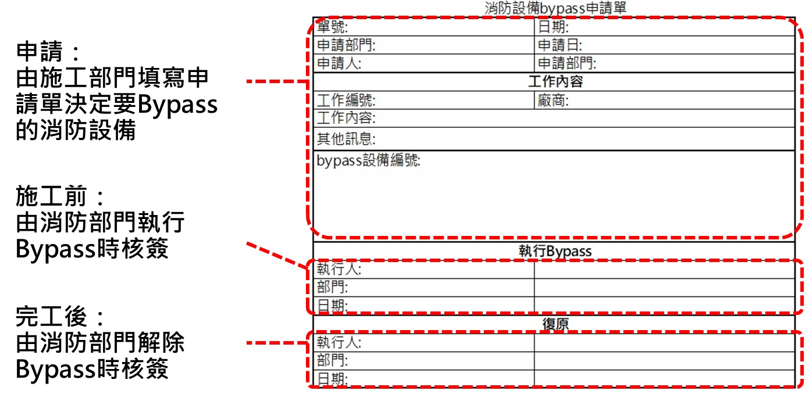
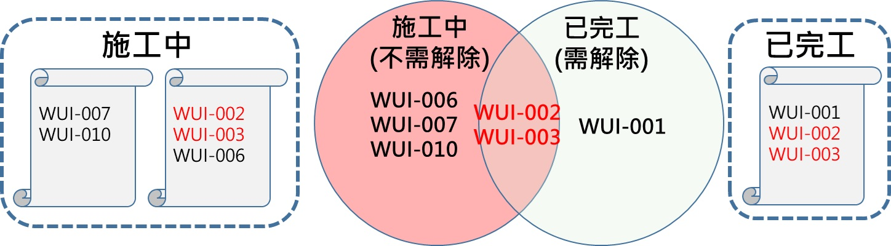
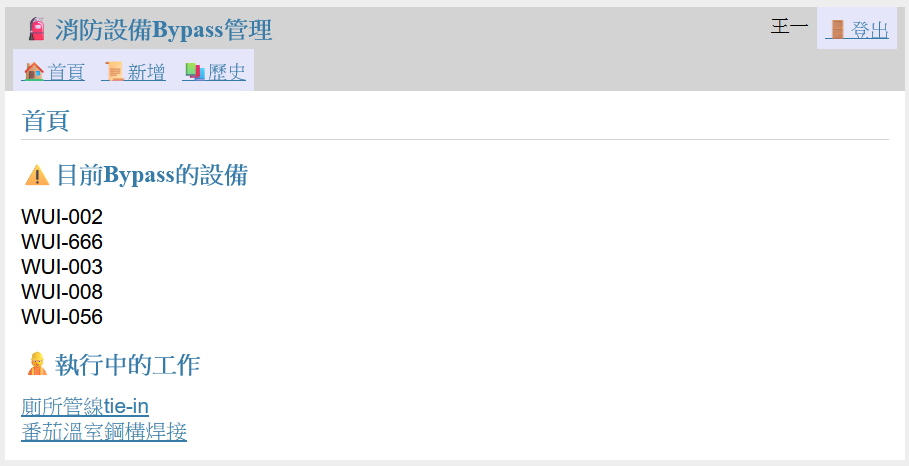
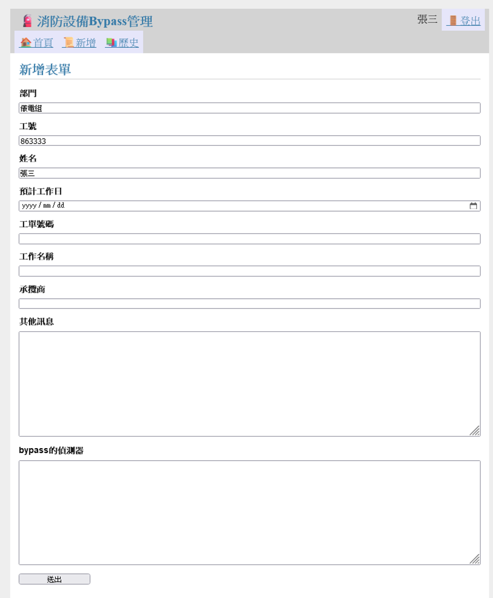
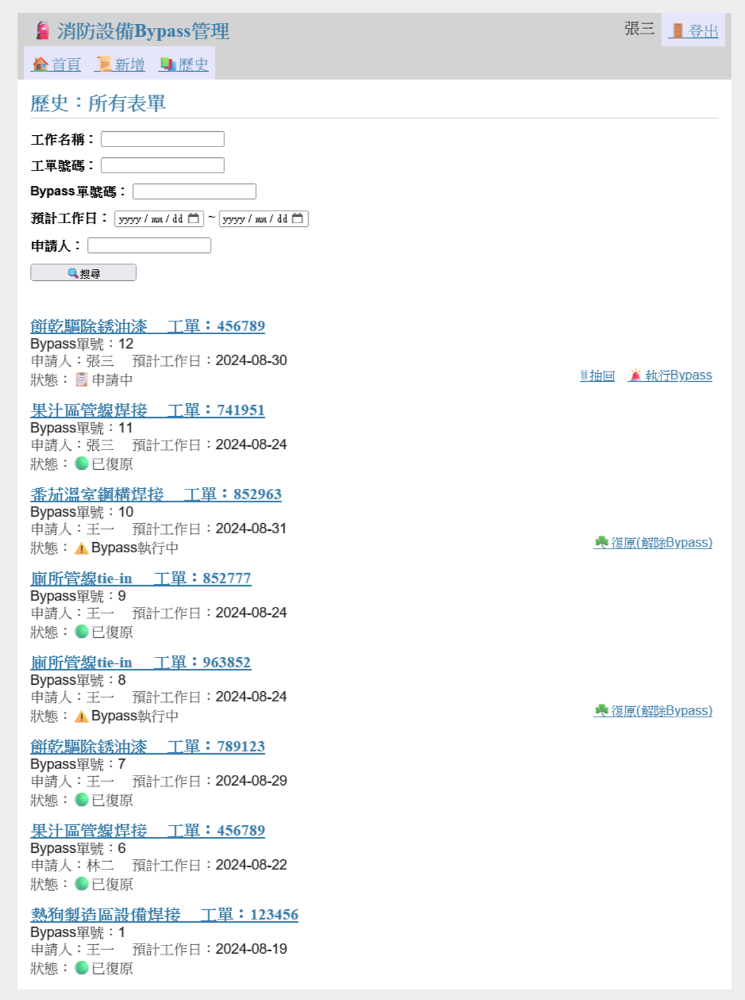
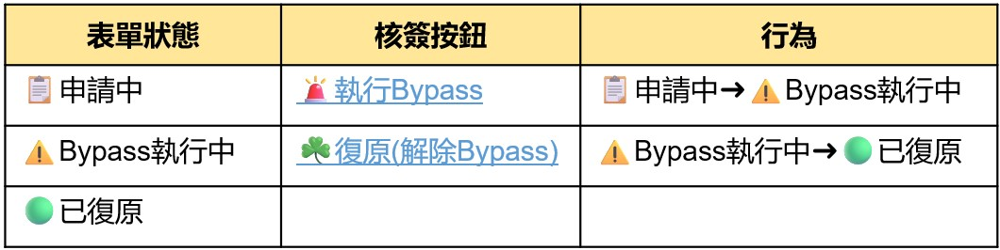
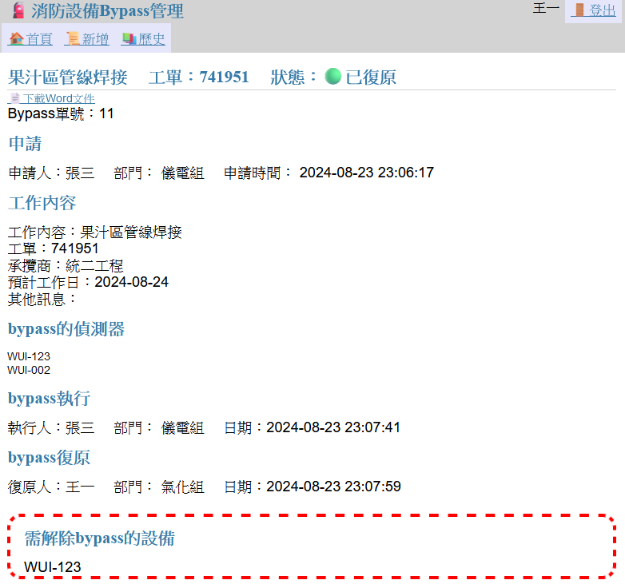
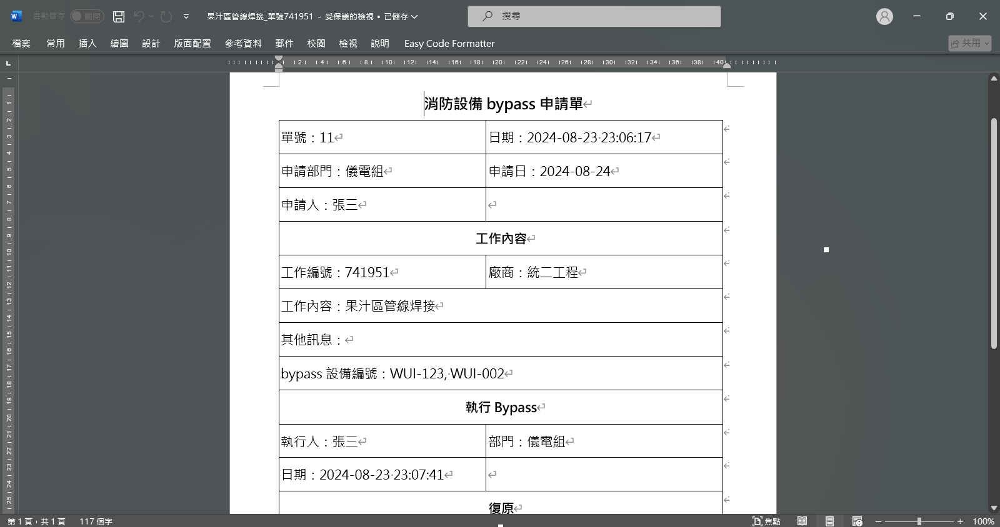

# fire_detector_management
## 為什麼要將消防Bypass
* 一大樓或工廠內有許多的火警偵測器，在平常它們是用來偵測火災是否發生。
* 為了避免在施工期間造成不必要的誤警報，會暫時將相關偵測器bypass掉，避免誤警報的產生。

## 目前管理方式
* 為了管理消防設備的bypass，
* 採用紙本表單，由施工單位提出消防bypass需求，由消防單位來執行偵測器的bypass，當施工完成後，由消防單位再將bypass復原。

### 這個方法遇到的難處
* 當有部分的工作已經完成需解鎖時，已完工的那張「申請單」內「需解除Bypass的設備」可能包含於「目前正在施工中的單子中」。
* 這時需要人工挑出需要解除Bypass的設備，效率低下又可能出錯。

## 改善方法
* 引入線上表單管理：以網頁來替代傳統紙本表單，在線上直接記錄和管理 消防設備的Bypass。
在完工後，核簽復原時，自動的找出需解除Bypass的設備。

## 功能介紹
### 首頁
* 執行中的工作：列出目前正在進行的施工項目，方便管理人員快速掌握現場情況。

* 讓管理人員能夠一目了然地查看目前處於Bypass狀態的設備，便於後續管理和監控。

### 新增表單
* 此頁面由施工部門填寫，如：工作內容、預計工作時間和要進行Bypass的設備。

### 歷史:所有表單
* 此頁面列出所有已提交的表單，並列出表單的重要資訊，方便管理人員查看。

* 搜尋功能：使用者可以根據特定條件快速篩選出相關表單。

### 表單內容
* 查看表單詳細內容。
* 核簽按鈕：系統會根據表單狀態出現不同的核簽按鈕，用戶可點核簽按鈕來改變表單狀態。

* 當表單狀態為「已復原」時，會提示需解除鎖點的點位。

### 下載Word文件
* 在表單內容的頁面有"📄下載Word文件"按鈕，可將表單內容轉成 Word 文件。

* 可應對初期導入階段的過渡需求，紙本與線上表單共存。

----
* Icons made by Freepik from [www.flaticon.com](www.flaticon.com) is licensed by [CC BY 3.0](http://creativecommons.org/licenses/by/3.0/) 

